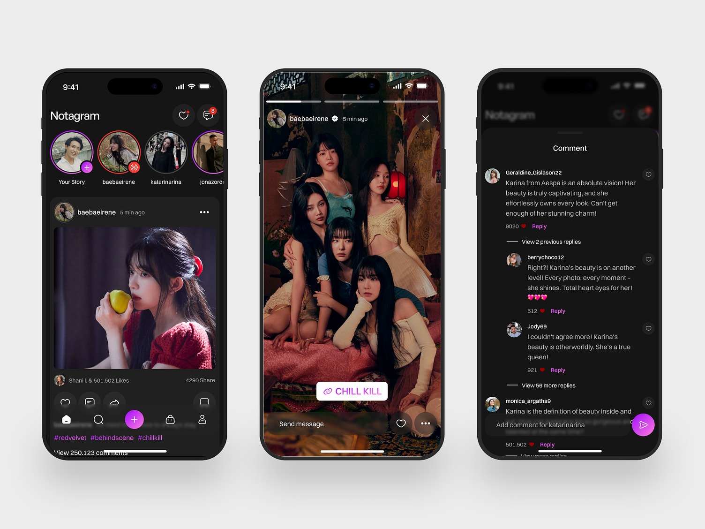

# Makko Social Server

**Project name**: Makko Social App

**Loading Logo**: Reference from Leonardo.ai

**Makko** is a cutting-edge social media app built with React Native, offering a seamless and responsive experience
across all mobile devices. Our app combines sleek design with powerful functionality, ensuring that users can
effortlessly connect, share, and explore content anytime, anywhere.

**Project Structure**

| Module          | Function |
|-----------------|----------|
| controller      |          |
| database        |          |
| module          |          |
| route           |          |
| service         |          |
| util            |          |
| AppConstants.ts |          |
| Config.ts       |          |
| Makko.ts        |          |

**List Models:**

- Hugging Face:
    + Conversation AI
    + Text to image
    + Text to speech
- Prodia:
    + Text to image
